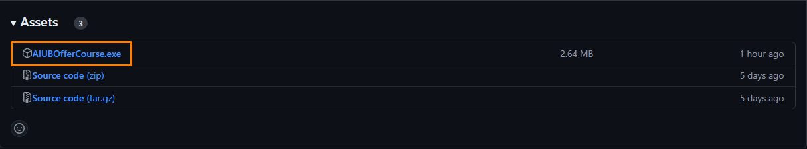
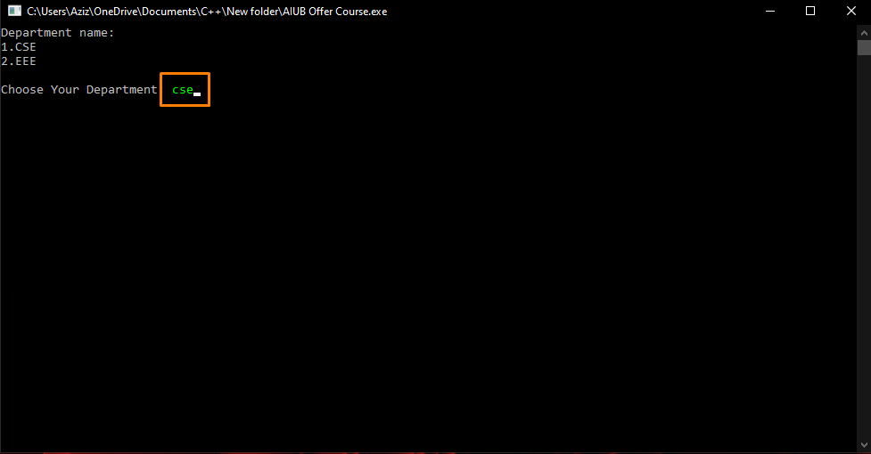
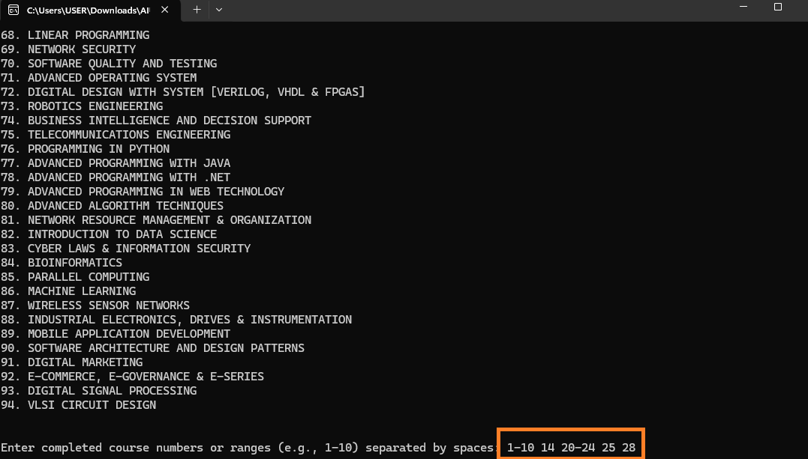
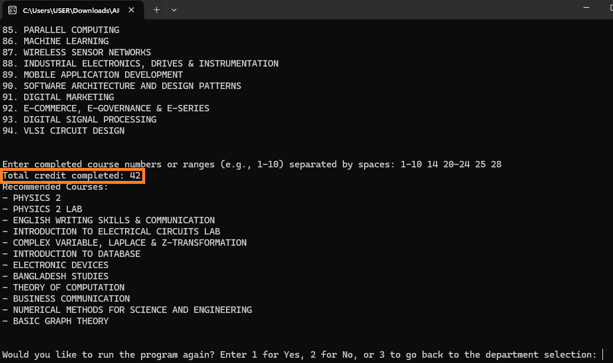
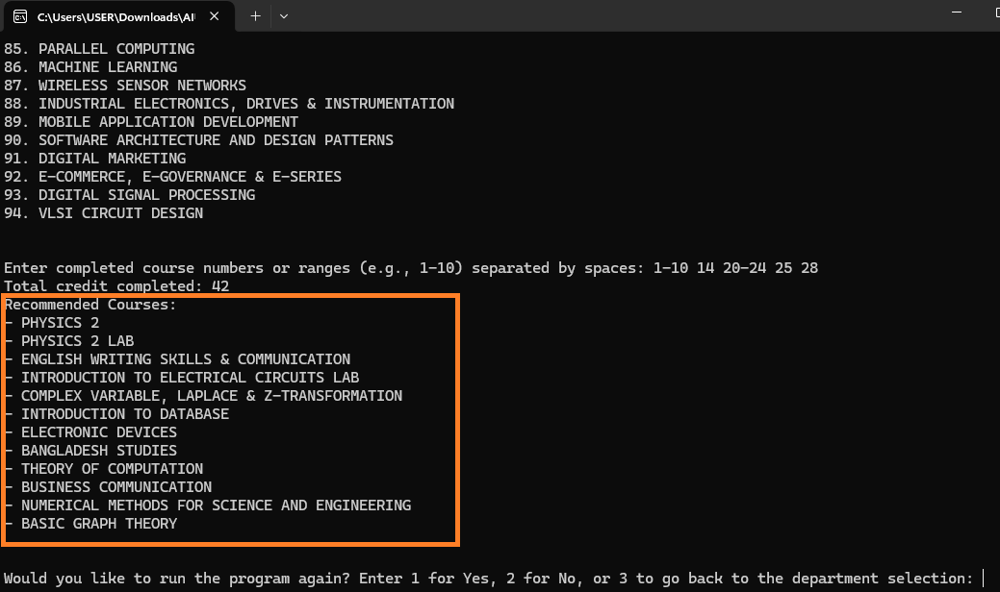
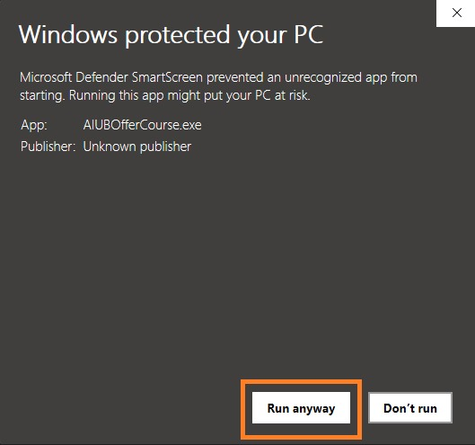

# AIUB Course Suggestion System

## Overview

The Course Suggestion System is a project designed to recommend courses for the next semester based on the user's completed courses. It analyzes the user's academic history and suggests relevant courses to help them progress in their academic journey.

## Features
- **User Input**: Allows users to enter completed course numbers.
- **Course Recommendations**: Outputs a list of offered courses for the next semester based on user input.
- **Download Option**: Users can download the latest release from the ['Releases'](https://github.com/Basharul2002/AIUB-Course-Suggestion-System/releases) section.

## How to Use
1. Download the latest release from the ['Releases'](https://github.com/Basharul2002/AIUB-Course-Suggestion-System/releases) section
   
     
3. Run the application in your console
4. Choose your deparment
   
     
6. Follow the on-screen prompts to input your completed course numbers
   
     
8. View the total completed credit
   
     
10. View the list of offered courses for your next semester
   

## Installation
To install the AIUB Course Suggestion System, follow these steps:

1. **Download the Application**
   - Navigate to the [Releases](https://github.com/Basharul2002/AIUB-Course-Suggestion-System/releases) section.
   - Download the latest version of the software.

2. **Run the Installer**
   - After downloading, double-click the software file to begin the installation process.

3. **Handle Security Prompts**
   - If a security prompt appears, click on **"More Info"** to view additional options.
       
   - Then, click on **"Run Anyway"** to proceed with the installation.
     

4. **Follow On-Screen Instructions**
   - Follow the on-screen instructions to complete the installation.

Once installed, you can run the AIUB Course Suggestion System from your desktop or start menu.

## License
Distributed under the GPL-3.0 license. See [`LICENSE`](https://github.com/Basharul2002/AIUB-Course-Suggestion-System?tab=GPL-3.0-1-ov-file) for more information.

## Contact
Basharul Alam Mazu- [basharulalam6@gmail.com](basharulalam6@gmail.com)

## Run in Gitpod

You can also run AIUB Course Suggestion System in Gitpod, a free online dev environment for GitHub:

OOPS, this isn't working quite yet :/

