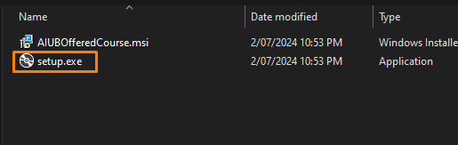
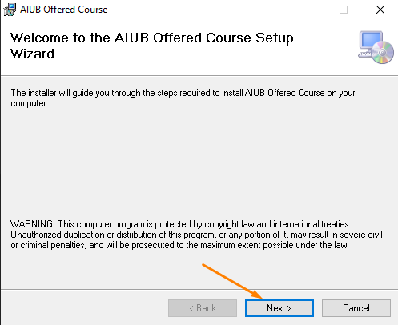
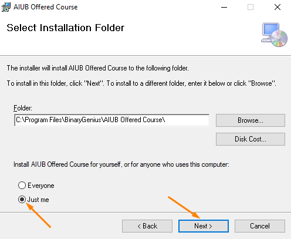
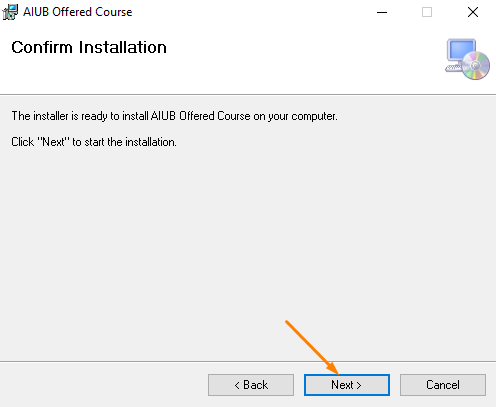
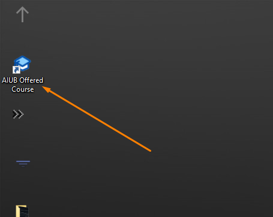

# AIUB Course Suggestion System

## Overview

The Course Suggestion System is a project designed to recommend courses for the next semester based on the user's completed courses. It analyzes the user's academic history and suggests relevant courses to help them progress in their academic journey.

## Features
- **User Input**: Allows users to enter completed course numbers.
- **Course Recommendations**: Outputs a list of offered courses for the next semester based on user input.
- **Download Option**: Users can download the latest release from the ['Releases'](https://github.com/Basharul2002/AIUB-Course-Suggestion-System/releases) section.

## How to Use
1. **Download the Latest Release**
   - Visit the [Releases](https://github.com/Basharul2002/AIUB-Course-Suggestion-System/releases) section.
   - Click on the latest release to download the ZIP file.

      
     

2. **Extract the Downloaded Folder**
   - Right-click the downloaded ZIP file and select "Extract All..."
   - Choose a destination and click "Extract".

     
     

3. **Run the Setup**
   - Open the extracted folder and double-click on `setup.exe`.
   
      
     

4. **Follow the Setup Process**
   - Proceed through the setup steps as shown below:
   
      
     
   
      
     

     
     

5. **Open the Program**
   - Once the setup is complete, open the program from the installation directory.
   
      
     

6. **Select Your Department**
   - In the program, select your department from the dropdown menu.
   - Click on 'Proceed' or press the 'Enter' key.
   
      
     

7. **Enter Completed Courses**
   - Input your completed course IDs as prompted.
   - Click on 'Proceed' or press the 'Enter' key.
   
      
     

8. **Refresh or Change Department**
   - To see your departmental courses again, click the 'Refresh' button.
   - To change the department, click the 'Back' button.
   
      
     

By following these steps, you will be able to set up and use the AIUB Course Suggestion System with ease. Enjoy!

## Installation
To install the AIUB Course Suggestion System, follow these steps:

1. **Download the Application**
   - Navigate to the [Releases](https://github.com/Basharul2002/AIUB-Course-Suggestion-System/releases) section.
   - Download the latest version of the software.

2. **Run the Installer**
   - After downloading, double-click the software file to begin the installation process.

3. **Handle Security Prompts**
   - If a security prompt appears, click on **"More Info"** to view additional options.
       
   - Then, click on **"Run Anyway"** to proceed with the installation.
     

4. **Follow On-Screen Instructions**
   - Follow the on-screen instructions to complete the installation.

Once installed, you can run the AIUB Course Suggestion System from your desktop or start menu.

## License
Distributed under the GPL-3.0 license. See [`LICENSE`](https://github.com/Basharul2002/AIUB-Course-Suggestion-System?tab=GPL-3.0-1-ov-file) for more information.

## Contact
For any issues or inquiries, feel free to reach out to me at [basharulalam6@gmail.com](mailto:basharulalam6@gmail.com) or visit my [website](https://basharul2002.github.io/).

## Run in Gitpod

You can also run AIUB Course Suggestion System in Gitpod, a free online dev environment for GitHub:

OOPS, this isn't working quite yet :/

